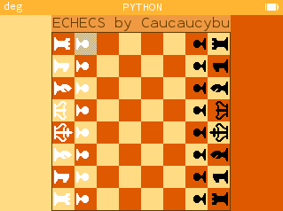

## Échecs

### Description

Le jeu d'échecs est un jeu de stratégie combinatoire abstrait pour deux joueurs. Le but du jeu est de mettre le roi adverse en échec et mat, c'est-à-dire qu'il ne peut plus bouger sans être capturé.

   
### Installation

Pour installer le jeu d'échecs, il suffit de se rendre sur le site de NumWorks et d'installer les scripts suivants :
- [pieces_echecs.py](https://my.numworks.com/python/caucaucybu/pieces_echecs.py)
- [parties_echecs.py](https://my.numworks.com/python/caucaucybu/parties_echecs.py)
- [echecs.py](https://my.numworks.com/python/caucaucybu/echecs.py)

### Fonctionnalités

- Déplacement des pièces
- Prise en passant
- Roque
- Promotion du pion
- Affichage des coups possibles
- Affichage des coups joués
- Affichage de l'échec et de l'échec et mat
- Affichage du pat
- Affichage de la nulle par manque de matériel
- Menu de configuration
- Sauvegarde et chargement des parties

### Utilisation

- Pour jouer, il suffit d'exécuter le script `echecs.py`.
- Pour déplacer une pièce, il suffit de sélectionner la pièce à déplacer puis de sélectionner la case de destination en utilisant les flèches directionnelles et la touche `OK` pour valider le coup.
- Pour annuler un coup, il suffit de cliquer sur le bouton `BACK`.
- Pour revenir en arrière dans la partie, il faut utiliser les boutons `shift` (pour aller en arrière) et `backspace` (pour aller en avant).
- Pour afficher le menu, il suffit de cliquer sur le bouton `HOME`.
- Pour sauvegarder la partie, il suffit de quitter la partie puis de copier les lignes qui se sont affichées et de les coller dans le script `parties_echecs.py` entre les crochets.